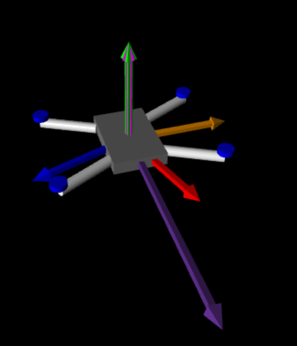

# 3dV
## Overview
3dV is a simple python program which allows you to test and experiment with any accelarometer and gyroscope sensor. 3dV takes inputs from the sensor through the serial port. It read `yaw` `pitch` and `roll`. 

    

Then it displays the orientation of the sensor in realtime.

## Use
3dV requires the `vpython` and `serial` library, so make sure those are installed. The serial reader expects the input in the form of "`ypr \t yaw \t pitch \t roll`"

Follow that format or edit it to your need accordingly